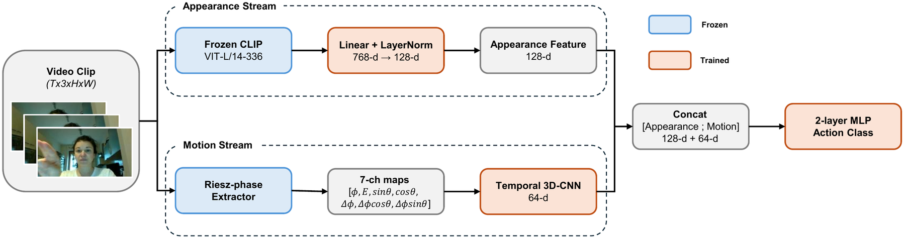
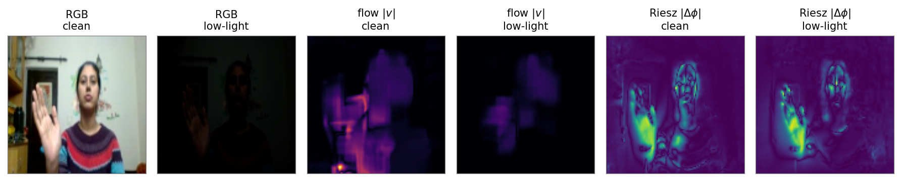

<div align="center">

# Motion That Survives the Dark

### Illumination-Robust Riesz-Phase Motion for Frozen Foundation-Model Video Recognition

**Dohhoon Kim, Nirmal Adhikari, Chingiz Tursunbaev, Ahyun Kim, John Heong Lee, Wookey Lee**

Inha University

[](https://accv2026.org/)
[](LICENSE)
[](requirements.txt)
[](https://pytorch.org/)



</div>

## Overview

Image foundation models such as CLIP are motion-blind, and the usual motion streams —
optical flow and frame difference — are intensity-based, so they degrade when the input
does. We attach a **training-free Riesz-phase motion stream** to a frozen CLIP and learn
only a small temporal 3D-CNN and fusion head. Because local phase is invariant to the
amplitude of local structure, the temporal phase difference Δφ survives illumination
loss. The study is **controlled**: backbone, encoder, head, and training recipe are fixed,
and only the motion representation is swapped.

<div align="center">

<br><em>Under low light the RGB frame is barely readable and optical flow collapses to noise,
while the Riesz phase difference |Δφ| stays largely intact.</em>
</div>

## Main results

Full Jester (118,562 train / 14,787 val), models trained on **clean** data, 3 seeds.

| Condition | Riesz-phase | Optical flow | Frame diff. |
|---|:---:|:---:|:---:|
| Clean | 0.848 | 0.831 | **0.869** |
| Low light s5, no adaptation | **0.572** | 0.262 | 0.262 |
| Low light s5 + mean-based gamma correction | 0.845 | 0.832 | **0.862** |
| Non-invertible control s5 (shot/read noise, 8-bit) | **0.360** | 0.245 | 0.249 |

The advantage is **conditional**: a simple test-time gamma correction largely undoes the
synthetic low light and removes the gap, whereas a non-invertible degradation preserves it.
Phase helps small, local motion (hand gestures) under degradations that are left
uncorrected or that a pointwise photometric correction cannot undo; it is weaker under
motion blur, and on naturally dark whole-body video (ARID) the advantage vanishes. See the
paper for the full regime map, IPN Hand, RAFT, and the mechanism analysis.

## Installation

```bash
git clone https://github.com/kimdohhoon/riesz-phase-motion.git
cd riesz-phase-motion
pip install -r requirements.txt
```

CLIP weights are downloaded from the Hugging Face hub (`openai/clip-vit-large-patch14-336`).
To use a local copy, set `CLIP_MODEL=/path/to/clip-vit-large-patch14-336`.

## Data preparation

Download the datasets and point the code at them (see `rieszmotion/paths.py`):

```bash
export JESTER_ROOT=/path/to/20bn-jester-v1     # jpg frames
export JESTER_DIR=/path/to/jester-csvs         # jester-v1-{train,validation,labels}.csv
export IPN_ROOT=/path/to/ipn/frames            # IPN Hand frames
export IPN_ANNOT_DIR=/path/to/ipn/annotations  # Annot_{Train,Test}List.txt
export ARID_ROOT=/path/to/arid/clips_v1.5      # ARID v1.5 .mp4
export ARID_LIST_DIR=/path/to/arid             # ARID_split1_{train,test}.txt
```

| Dataset | Split used | Notes |
|---|---|---|
| [Jester](https://www.qualcomm.com/developer/software/jester-dataset) | official validation | test labels are not public; class indices follow the line order of `jester-v1-labels.csv` |
| [IPN Hand](https://gibranbenitez.github.io/IPN_Hand/) | official test list | no-gesture class `D0X` removed (13 classes) |
| [ARID v1.5](https://xuyu0010.github.io/arid.html) | official split 1 | `.avi` names in the lists are remapped to `.mp4` |

Frozen features are cached under `cache/` once per (dataset, representation, condition)
and reused across seeds; a full-Jester cache for one representation and condition is a
few GB.

## Quick start

All commands are run from the repository root.

```bash
# sanity checks, no data needed
python -m tests.verify_monogenic         # Δφ ∝ displacement, invariant to amplitude
python -m tests.verify_motion_cnn        # temporal CNN recovers motion direction
python -m rieszmotion.corrections        # gamma correction; oracle inverse of the main corruption
python -m rieszmotion.corruptions_noninvertible

# main experiment: extract features, train and evaluate (3 seeds), all corruptions
python -m experiments.full_study jester phase
python -m experiments.full_study jester flow
python -m experiments.full_study jester framediff
python -m experiments.aggregate_full jester
```

## Reproducing the paper

<details>
<summary><b>Main comparison and baselines</b> (Tab. 1–6, Tab. 8, Fig. 3)</summary>

| Paper | Command |
|---|---|
| Tab. 1, 3, 4, 6; Fig. 3 | `python -m experiments.full_study {jester,ipn} {phase,flow,framediff}`, then `python -m experiments.aggregate_full {jester,ipn}` |
| ARID (Sec. 5, Supp. Tab. 5) | `python -m experiments.full_study arid {phase,flow,framediff}` |
| Tab. 2, design ablation | `python -m experiments.ablation_study` |
| Tab. 5, RAFT | `python -m experiments.raft_compare` |
| Channel-matched flow / frame difference (Sec. 4.4) | `python -m experiments.channel_match` |
| ViT-B/32 backbone (Sec. 4.4) | `python -m experiments.backbone_b32` |
| Tab. 8, direction pairs | `python -m experiments.dir_subset full` |
| Supp. Tab. 6, ARID per class | `python -m experiments.arid_motion_split` |

</details>

<details>
<summary><b>Test-time corrections and the non-invertible control</b> (Tab. 7, Supp. Tab. 7)</summary>

```bash
# feature-level rescaling (transductive upper bound)
python -m experiments.controls.feature_rescaling --rep {phase,flow,framediff}

# pixel-level mean-based gamma correction on the main corruption (s5)
python -m experiments.controls.extract_controls --ds jester --corruption main --sev 5 --arm {none,gamma}
python -m experiments.controls.eval_controls --ds jester --rep {phase,flow,framediff} --set gamma

# non-invertible control (s3, s5), with and without the correction
python -m experiments.controls.extract_controls --ds {jester,ipn} --corruption noninvertible --sev {3,5} --arm {none,gamma}
python -m experiments.controls.eval_controls --ds {jester,ipn} --rep {phase,flow,framediff} --set noninvertible

# probes: choice of read noise; corrected mean luminance
python -m experiments.controls.calibrate_noise
python -m experiments.controls.measure_gamma_mean
```

</details>

<details>
<summary><b>Appearance-only temporal baseline</b> (Sec. 4.7, Supp. Tab. 8)</summary>

```bash
python -m experiments.temporal_baseline.extract_temporal_app --split train --cond clean
python -m experiments.temporal_baseline.extract_temporal_app --split val --cond {clean,ll5_none,ll5_gamma,ll5r_none}
python -m experiments.temporal_baseline.train_temporal_app
python -m experiments.temporal_baseline.train_fused_12k      # fused model on the same 12k subset
```

</details>

<details>
<summary><b>Mechanism analysis</b> (Sec. 4.8, Supp. Tab. 9)</summary>

```bash
python -m experiments.mechanism.mechanism_metrics       # pattern / amplitude, per class
python -m experiments.mechanism.mechanism_correlation   # accuracy vs. motion SNR (27 cells)
```

</details>

<details>
<summary><b>Figures</b></summary>

| Figure | Command |
|---|---|
| Fig. 2, Riesz decomposition | `python -m figures.fig_decomposition` |
| Fig. 3, low-light curves | `python -m figures.make_pub_figures` |
| Fig. 4, mechanism strip | `python -m figures.fig_mechanism` |
| Supp. Fig. 1, six gestures | `python -m figures.fig_supp_mechanism_grid` |
| Supp. Fig. 2–3, heatmap and corruption curves | `python -m figures.fig_supp_curves` |
| Per-gesture panels | `python -m figures.visualize_mechanism_v2 jester` |

Every figure is written as PNG and as a vector PDF (TrueType fonts), the format used in
the paper. Fig. 1 is a drawn diagram.

</details>

Results are written to `runs/` as JSON. All experiments train on clean data and evaluate
on corrupted validation clips without adaptation, with seeds 0, 1, 2.

## Repository structure

```
rieszmotion/            core library
  monogenic.py            Riesz / monogenic extraction (FFT, Log-Gabor bands, Riesz kernel)
  motion_features.py      phase / flow / frame-difference / RAFT motion maps
  motion_cnn.py           temporal 3D-CNN
  clip_features.py        frozen CLIP appearance encoder (middle frame)
  train.py                two-stream model, dataset factory, training and evaluation
  corruptions.py          low light (x^γ·α), Gaussian noise, motion blur
  corruptions_noninvertible.py   low light + shot/read noise + 8-bit requantization
  corrections.py          mean-based gamma correction, oracle inverse
  datasets.py, paths.py   Jester / IPN Hand / ARID loaders and paths
experiments/            main comparison, baselines, ablation
  controls/               test-time corrections, non-invertible control
  temporal_baseline/      appearance-only temporal baseline
  mechanism/              pattern / amplitude and SNR analysis
figures/                figure scripts
tests/                  data-free sanity checks
```

## Citation

```bibtex
@inproceedings{kim2026motion,
  title     = {Motion That Survives the Dark: Illumination-Robust Riesz-Phase Motion
               for Frozen Foundation-Model Video Recognition},
  author    = {Kim, Dohhoon and Adhikari, Nirmal and Tursunbaev, Chingiz and
               Kim, Ahyun and Lee, John Heong and Lee, Wookey},
  booktitle = {Proceedings of the Asian Conference on Computer Vision (ACCV)},
  year      = {2026}
}
```

## Acknowledgements

This work was supported by the Institute of Information & Communications Technology
Planning & Evaluation (IITP) grant funded by the Korea government (MSIT)
(No. RS-2022-II220641, XVoice) and by the National Research Foundation of Korea (NRF)
(No. RS-2025-24534935). We use CLIP through Hugging Face `transformers` and RAFT through
`torchvision`.

## License

This project is released under the [MIT License](LICENSE).
